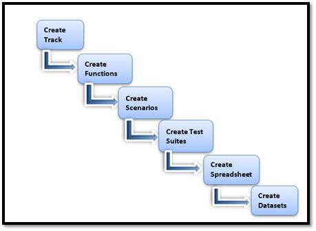

Test Configuration Steps

Test configuration and Data setups are typically performed by the Test Developers and Functional Analysts. This will be required when you need to test a new application or deploy new changes to an existing application.

The diagram below illustrates the sequence in which you need to perform to test configuration and test data. This will be an on-going task and the frequency of changes is determined by your testing needs.
<Frame width="auto" height="auto" >
  
</Frame>
